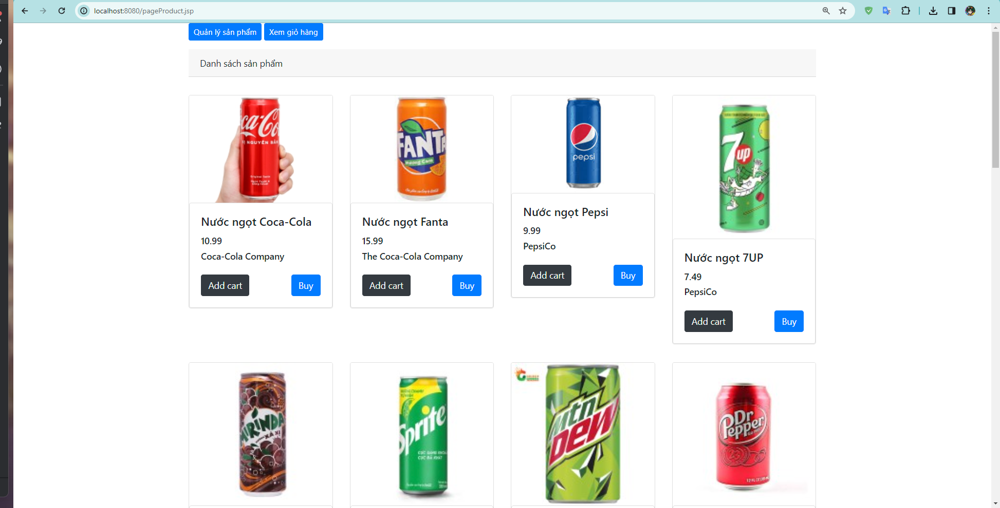
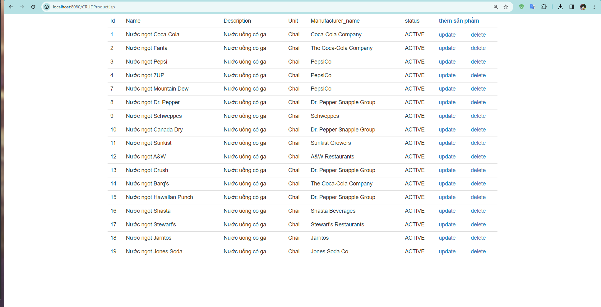
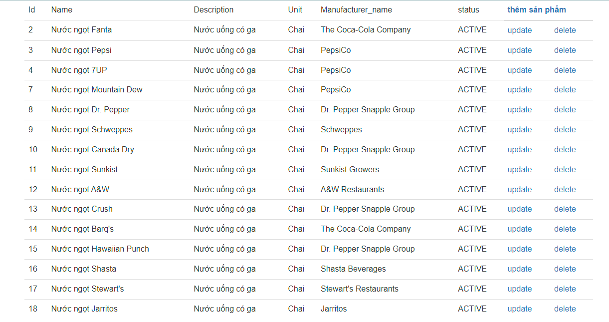
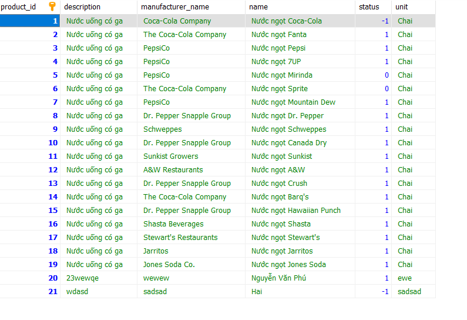
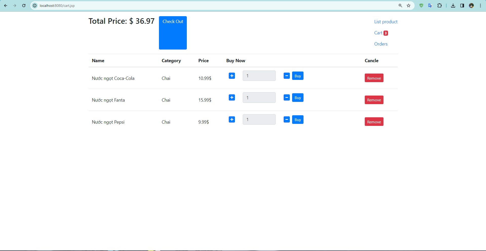
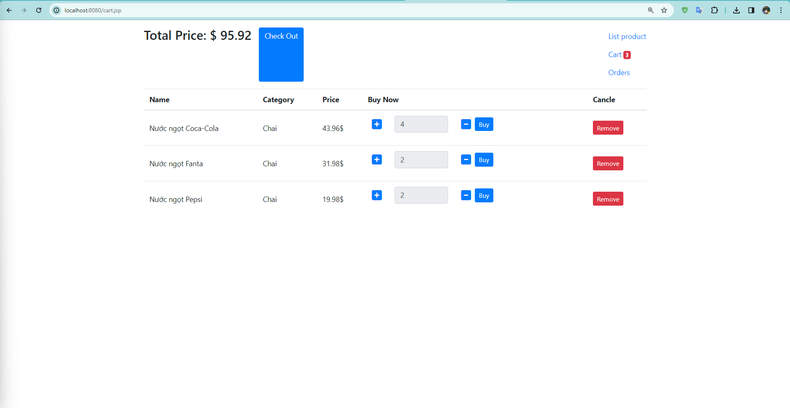

# week02_lab_20048881_NguyenVanPhu
# Projects Jakarta EE Week 2 + 3
- Sinh viên: **Nguyễn Văn Phú**
- Hướng dẫn: **TS. Võ Văn Hải**
# Trang web bán hàng

## BackEnd
- **Ý tưởng:** Lập 1 `API` cho trang web bán hàng.  
- **Sử dụng:** `REST API Jakarta EE`  `CRUD JPA`  
- **Mô tả:** 
    - Các thao tác `CRUD` cho các đối tượng, lập order.  
- Lập REST API cho các thao tác cần thiết của yêu cầu này (dùng JakartaEE):
- Các thao tác CRUD cho các đối tượng, lập order. (dùng JPA).
- Thống kê order theo ngày, theo khoảng thời gian.
- Thống kê order theo nhân viên bán hàng trong 1 khoảng thời gian.
- **API:** sử dụng tool postman & API Endpoints
- ## CRUD
-   **Employee**

  -   Read: `GET /api/employees`
  -   Read by employee id: `GET /api/employees/{id}`
  -   Create: `POST /api/employees`
  -   Update: `PUT /api/employees`
  -   Delete: `DELETE /api/employees/{id}`

-   **Product**

  -   Read: `GET /api/products`
  -   Read by product id: `GET /api/products/{id}`
  -   Read images by product id: `GET /api/products/{id}/images`
  -   Create: `POST /api/products`
  -   Update: `PUT /api/products`
  -   Delete: `DELETE /api/products/{id}`

-   **Customer**

  -   Read: `GET /api/customers`
  -   Read by customer id: `GET /api/customers/{id}`
  -   Create: `POST /api/customers`
  -   Update: `PUT /api/customers`

-   **Product Image**

  -   Read: `GET /api/product-images`
  -   Read by product image id: `GET /api/product-images/{id}`
  -   Create: `POST /api/product-images`
  -   Update: `PUT /api/product-images`

-   **Order**

  -   Read: `GET /api/orders`
  -   Read by order id: `GET /api/orders/{id}`
  -   Create: `POST /api/orders`
  -   Update: `PUT /api/orders/{id}`

-   **Order Detail**

  -   Read: `GET /api/order-details`
  -   Read: `GET /api/order-details/{order-id}/{product-id}`
  -   Create: `POST /api/order-details`
  -   Update: `PUT /api/order-details/{order_id}/{product_id}`

-   **Product Price**

  -   Read: `GET /api/product-prices`
  -   Read new price of product: `GET /api/product-prices/{id}`
  -   Create: `POST /api/product-prices`
  -   Update: `PUT /api/product-prices`

## Font-end
- **Ý tưởng:** Làm dựa trên mô hình MVC.  
- **Sử dụng:** `REST API Jakarta EE`  `CRUD JPA`  
- **Mô tả:** 
- Tạo các trang web cho việc hiển thị sản phẩm, chọn vào giỏ hàng và thanh toán (giả lập
  việc thanh toán qua thẻ nếu có thể)
- - Thống kê order theo ngày, theo khoảng thời gian.
- Thống kê order theo nhân viên bán hàng trong 1 khoảng thời gian.
**Demo giao diện kèm video**
## Danh sách sản phẩm

## Quản lý sản phẩm
- hiển thị các sản phẩm ở trạng thái active

-sản phẩm bị xóa chuyển trạng thái ACTIVE thành TERMINATED

## giỏ hàng

**video demo**
[2023-11-16 11-47-40.mp4](..%2F..%2F..%2Fvideothi%2F2023-11-16%2011-47-40.mp4)